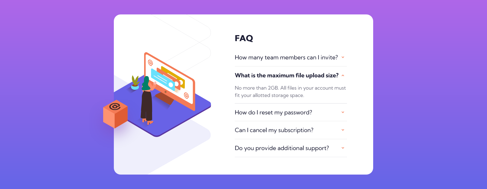

# Frontend Mentor - FAQ accordion card solution

This is a solution to the [FAQ accordion card challenge on Frontend Mentor](https://www.frontendmentor.io/challenges/faq-accordion-card-XlyjD0Oam). Frontend Mentor challenges help you improve your coding skills by building realistic projects. 

## Table of contents

- [Overview](#overview)
  - [The challenge](#the-challenge)
  - [Screenshot](#screenshot)
  - [Links](#links)
- [My process](#my-process)
  - [Built with](#built-with)
  - [What I learned](#what-i-learned)
  - [Useful resources](#useful-resources)
- [Author](#author)


## Overview

### The challenge

Users should be able to:

- View the optimal layout for the component depending on their device's screen size
- See hover states for all interactive elements on the page
- Hide/Show the answer to a question when the question is clicked

### Screenshot




### Links

- Solution URL: [Code](https://github.com/tan911/FAQ-accordion-app)
- Live Site URL: [Live site](https://tan911.github.io/FAQ-accordion-app/)

## My process

### Built with

- Semantic HTML5 markup
- CSS custom properties
- Flexbox
- CSS Grid
- Sass/scss
- Mobile-first workflow
- Javascript
- BEM (naming convention)
- accessibility


### What I learned

I'm accepting this challenge in order to implement an accessible accordion. So before getting into the coding, I first started reading about [WAI-accessibility](https://www.w3.org/WAI/). ARIA's It's helpful to be familiar with it.


When compared to [WAI ARIA](https://www.w3.org/WAI/ARIA/apg/example-index/accordion/accordion) Implementation, this application's design pattern is noticeably different. However, I have noted a few crucial aspects about it.

- keyboard support
- role, attributes

My application should provide keyboard navigation for the user. In my HTML document, it appears as follows,
```html
<div>
    <h3>
        <button>
            <span>title</span>
        </button>
    </h3>
    <div>
        <p>content</p>
    <div>
<div>
```
According to WAI-ARIA, level 3 headings are appropriate for every element that functions as an accordion header,\ and including a button inside of one of these headings adds a lot of useful functionality for those who use keyboards. Because I don't even need to create a single line of javascript to navigate this button by default using the tab and shift-tab keys.

Here are a few key features of my buttons that will help every user of assistive technology and\ enable them to comprehend the content of my application.
```html
<div>
    <h3>
        <button id="accordion__one" class="accordion__btn" type="button" aria-expanded="false" aria-controls="accordion__one__content">
            <span>title</span>
        </button>
    </h3>
    <div id="accordion__one__content" role="region" class="accordion__content" aria-hidden="true" aria-labelledby="accordion__one">
        <p>content</p>
    <div>
<div>
```
To indicate that my button is labeled to that content, the id value of my button should match the aria-labelled by my content(div).\ However, in my application, each button has its own content.
- button: ### `id="accordion__one`  =  div: ### `aria-labelledby="accordion__one"`

[more info aria-labelledby](https://developer.mozilla.org/en-US/docs/Web/Accessibility/ARIA/Attributes/aria-labelledby)

My content's id attribute should be set to the same value as my button's aria-controls.\ This will switch my content's visibility, which is managed by my buttons, on and off.
- div: ### `id="accordion__one__content"` = button: ### `aria-controls="accordion__one__content"`

[more info aria-controls](https://developer.mozilla.org/en-US/docs/Web/Accessibility/ARIA/Attributes/aria-controls)

The ### `aria-expanded` is set to ### `false`, Since the content is initially hidden, I would need to use Javascript to set it to true so that the screen readers would proclaim it as either collapsed or expanded, depending on its value. I use [NVDA](https://www.nvaccess.org/). 

[more info aria-expanded](https://developer.mozilla.org/en-US/docs/Web/Accessibility/ARIA/Attributes/aria-expanded)

The ### `aria-hidden` is set to ### `true`, Initially, the content was hidden because there was no point in revealing it if it wasn't being displayed. Screen readers will therefore disregard it as a result.

[more info aria-hidden](https://developer.mozilla.org/en-US/docs/Web/Accessibility/ARIA/Attributes/aria-hidden)

Now that the user has interacted with them, I need to update the value of some of these properties.\
I initially concealed the content.
```js
content.setAttribute('hidden', '')
```

Then my instructions will be implemented into this when the user clicks.
```js
button.setAttribute('aria-expanded', 'true');
accordionContent.setAttribute('aria-hidden', 'false');
accordionContent.removeAttribute('hidden');
```
When the user clicks, the aria-expanded property will be set to true and the screen readers will proclaim that it is "expanded," as I had intended.
Setting the value of aria-hidden to false will ensure that screen readers will see this content when it has been shown.
then removing the content's hidden properties so that they may be seen visibly

### Useful resources

- [MDN docs](https://developer.mozilla.org/en-US/) 
- [WAI ARIA](https://www.w3.org/WAI/standards-guidelines/aria/) 


## Author

- Website - [Soon]()
- Frontend Mentor - [@tan](https://www.frontendmentor.io/profile/tan911)
